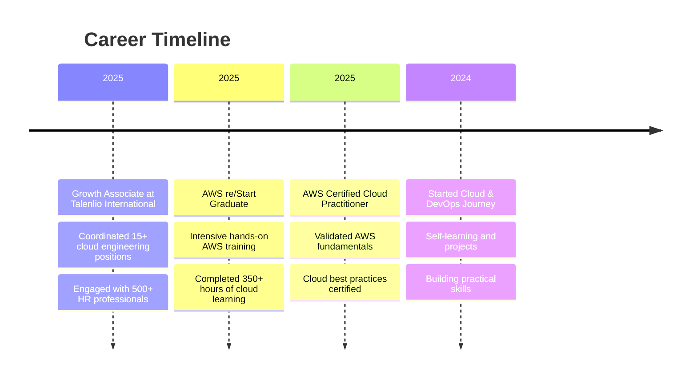
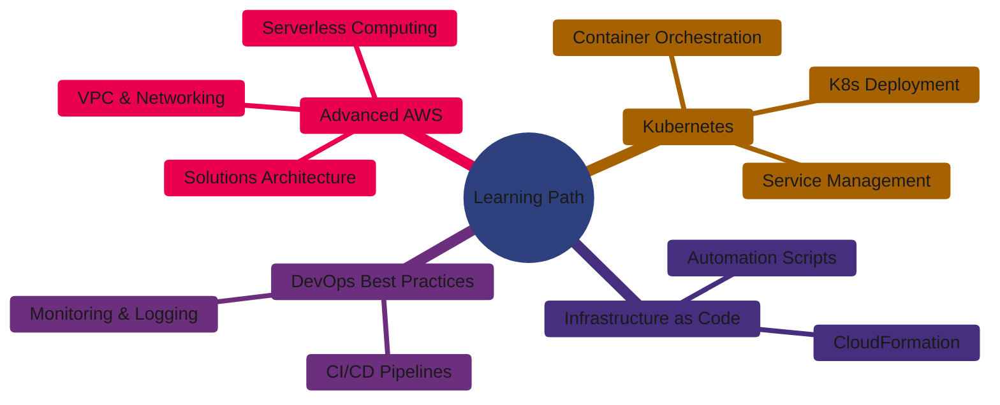

<div align="center">
  
</div>

<div align="center">
  
  [](https://git.io/typing-svg)
  
</div>

<div align="center">
  
  [](https://pravinsakhare.in)
  [](https://linkedin.com/in/pravin-sakhare-260720251)
  [](mailto:pravinsakhare592@gmail.com)
  
  
  
</div>

---

### 👨‍💻 About Me

```yaml
name: Pravin Sakhare
located_in: Pune, Maharashtra, India
current_role: Cloud & DevOps Engineer
education: 
  - "AWS re/Start Graduate"
  - "AWS Certified Cloud Practitioner"
  - "Bachelor's Degree - DY Patil International University"
  
interests: ["Cloud Computing", "DevOps Automation", "Container Technologies", "Web Development"]
currently_learning: ["Advanced AWS Services", "Kubernetes Fundamentals", "Infrastructure Automation"]
fun_fact: "State-level Chess Player ♟️ | Strategic thinking on and off the board!"

daily_routine: ["☕ Coffee", "💻 Code", "☁️ Cloud", "🔁 Repeat"]
```


### 🚀 What I'm Up To

- 🔭 Building and deploying applications on **AWS Cloud Infrastructure**
- 🌱 Learning **Kubernetes** and **advanced container orchestration**
- 👯 Open to collaborate on **cloud projects** and **DevOps automation**
- 💡 Exploring **serverless architectures** and **CI/CD pipelines**
- 📝 Sharing my journey on [pravinsakhare.in](https://pravinsakhare.in)
- ⚡ Passionate about **automation, security, and scalable solutions**

---

### 🛠️ Tech Stack & Tools

<div align="center">

#### ☁️ Cloud Platform


#### 🐳 Containers & CI/CD


#### 📊 Monitoring & Management


#### 💻 Programming & Scripting


#### 🗄️ Databases


#### 🐧 Operating Systems & Servers


#### 🔐 Security & Best Practices


</div>

---

### 📊 GitHub Statistics

<div align="center">
  
  
</div>

<div align="center">
  
  
</div>

---

### 🏆 Achievements

<div align="center">


</div>

---

### 🎯 Featured Projects

<table align="center">
  <tr>
    <td width="50%">
      <h3 align="center">AWS Secure Website Deployment</h3>
      <div align="center">
        <a href="https://github.com/pravinsakhare/aws-secure-website-deployment-guide" target="_blank">
          
        </a>
        <p>
          <a href="https://github.com/pravinsakhare/aws-secure-website-deployment-guide" target="_blank">
            
          </a>
        </p>
        <p><strong>AWS EC2, Apache, SSL/TLS, Let's Encrypt</strong> - Step-by-step guide for deploying secure static websites on AWS with automated SSL certificate management</p>
      </div>
    </td>
    <td width="50%">
      <h3 align="center">PixelFlare Photo Studio</h3>
      <div align="center">
        <a href="https://gzzmonk.me" target="_blank">
          
        </a>
        <p>
          <a href="https://gzzmonk.me" target="_blank">
            
          </a>
        </p>
        <p><strong>AWS, DynamoDB, S3, CloudFront</strong> - Full-stack photography studio website with cloud-native architecture, featuring dynamic galleries and serverless backend</p>
      </div>
    </td>
  </tr>
  <tr>
    <td width="50%">
      <h3 align="center">Cloud Infrastructure Projects</h3>
      <div align="center">
        <a href="https://github.com/pravinsakhare" target="_blank">
          
        </a>
        <p>
          <a href="https://github.com/pravinsakhare" target="_blank">
            
          </a>
        </p>
        <p><strong>AWS Services, Linux, Automation</strong> - Various cloud infrastructure projects focusing on EC2, VPC, S3, and automated deployments</p>
      </div>
    </td>
    <td width="50%">
      <h3 align="center">DevOps Learning Journey</h3>
      <div align="center">
        <a href="https://github.com/pravinsakhare" target="_blank">
          
        </a>
        <p>
          <a href="https://github.com/pravinsakhare" target="_blank">
            
          </a>
        </p>
        <p><strong>Docker, Kubernetes, Jenkins</strong> - Hands-on projects demonstrating containerization and CI/CD pipeline implementations</p>
      </div>
    </td>
  </tr>
</table>

---

### 📈 Contribution Graph

<div align="center">
  
</div>

---

### 🎓 Certifications & Achievements

<div align="center">

| Certification | Issuer | Year |
|--------------|---------|------|
| 🏅 **AWS Certified Cloud Practitioner** | Amazon Web Services | 2025 |
| 🎓 **AWS re/Start Graduate** | AWS Training & Certification | 2025 |
| ♟️ **State Level Chess Player** | Maharashtra Chess Association | Active |

</div>

---

### 💼 Professional Journey



---

### 📚 Currently Learning

<div align="center">



</div>

---

### 📫 Let's Connect!

<div align="center">
  
  [](https://linkedin.com/in/pravin-sakhare-260720251)
  [](https://twitter.com/__Space_craft)
  [](https://instagram.com/___itspravin__)
  [](https://www.youtube.com/@gzzmonk)
  [](https://pravinsakhare.in)
  [](mailto:pravinsakhare592@gmail.com)
  
</div>

---

### 💡 Random Dev Quote

<div align="center">
  


</div>

---

### 🐍 Contribution Snake

<div align="center">
  
</div>

---

<div align="center">
  
  ### 💭 My Motto
  
  > **"Learn. Build. Deploy. Share."**
  
  *Transforming ideas into cloud solutions, one project at a time.*
  
  ---
  
  **⭐ From [pravinsakhare](https://github.com/pravinsakhare) with ☁️ and ☕**
  
  
  
</div>
