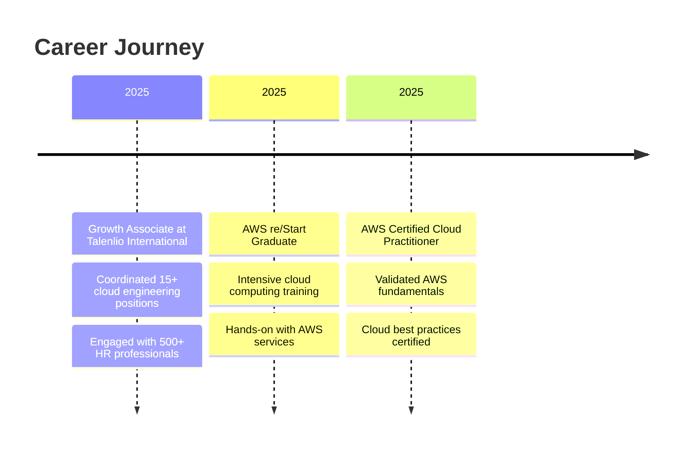

<div align="center">
  
</div>

<div align="center">
  
  [](https://git.io/typing-svg)
  
</div>

<div align="center">
  
  [](https://pravinsakhare.in)
  [](https://linkedin.com/in/pravin-sakhare-260720251)
  [](mailto:pravinsakhare592@gmail.com)
  
  
  
</div>

---

### 👨‍💻 About Me

```yaml
name: Pravin Sakhare
located_in: Pune, Maharashtra, India
current_role: Cloud & DevOps Engineer
education: 
  - "AWS re/Start Graduate"
  - "AWS Certified Cloud Practitioner"
  - "Bachelor's Degree - DY Patil International University"
  
interests: ["Cloud Architecture", "Infrastructure as Code", "Container Orchestration", "CI/CD Automation"]
currently_learning: ["Kubernetes CKA", "Advanced AWS Solutions", "Terraform Enterprise Patterns"]
fun_fact: "State-level Chess Player ♟️ | Applying chess strategies to cloud architecture!"

daily_routine: ["☕ Coffee", "💻 Code", "☁️ Cloud", "🔁 Repeat"]
```


### 🚀 What I'm Up To

- 🔭 Building production-ready cloud infrastructure with **AWS & Terraform**
- 🌱 Deep diving into **Kubernetes orchestration** and **GitOps workflows**
- 👯 Open to collaborate on **DevOps automation** and **cloud-native projects**
- 💡 Exploring **serverless architectures** and **microservices patterns**
- 📝 Sharing knowledge through [technical blogs](https://pravinsakhare.in)
- ⚡ Always optimizing for **performance, security, and cost efficiency**

---

### 🛠️ Tech Stack & Tools

<div align="center">

#### ☁️ Cloud Platforms


#### 🐳 Containers & Orchestration


#### 🔧 Infrastructure as Code


#### 🔄 CI/CD & Automation


#### 📊 Monitoring & Logging


#### 💻 Programming & Scripting


#### 🗄️ Databases


#### 🐧 Operating Systems


#### 🌐 Web Servers & Networking


#### 🔐 Security & Best Practices


</div>

---

### 📊 GitHub Statistics

<div align="center">
  
  
</div>

<div align="center">
  
  
</div>

---

### 🏆 Achievements

<div align="center">


</div>

---

### 🎯 Featured Projects

<table align="center">
  <tr>
    <td width="50%">
      <h3 align="center">AWS Secure Website Deployment</h3>
      <div align="center">
        <a href="https://github.com/pravinsakhare/aws-secure-website-deployment-guide" target="_blank">
          
        </a>
        <p>
          <a href="https://github.com/pravinsakhare/aws-secure-website-deployment-guide" target="_blank">
            
          </a>
        </p>
        <p><strong>AWS EC2, Apache, SSL/TLS</strong> - Production-ready static website deployment with automated SSL management</p>
      </div>
    </td>
    <td width="50%">
      <h3 align="center">PixelFlare Photo Studio</h3>
      <div align="center">
        <a href="https://gzzmonk.me" target="_blank">
          
        </a>
        <p>
          <a href="https://gzzmonk.me" target="_blank">
            
          </a>
        </p>
        <p><strong>AWS, DynamoDB, S3, CloudFront</strong> - Full-stack photo studio with cloud-native architecture</p>
      </div>
    </td>
  </tr>
  <tr>
    <td width="50%">
      <h3 align="center">Cloud Infrastructure Automation</h3>
      <div align="center">
        <a href="https://github.com/pravinsakhare" target="_blank">
          
        </a>
        <p>
          <a href="https://github.com/pravinsakhare" target="_blank">
            
          </a>
        </p>
        <p><strong>Terraform, CloudFormation</strong> - Automated infrastructure provisioning with IaC best practices</p>
      </div>
    </td>
    <td width="50%">
      <h3 align="center">Container Orchestration</h3>
      <div align="center">
        <a href="https://github.com/pravinsakhare" target="_blank">
          
        </a>
        <p>
          <a href="https://github.com/pravinsakhare" target="_blank">
            
          </a>
        </p>
        <p><strong>Kubernetes, Docker, CI/CD</strong> - Microservices deployment with automated pipelines</p>
      </div>
    </td>
  </tr>
</table>

---

### 📈 Contribution Graph

<div align="center">
  
</div>

---

### 🎓 Certifications & Achievements

<div align="center">

| Certification | Issuer | Year |
|--------------|---------|------|
| 🏅 **AWS Certified Cloud Practitioner** | Amazon Web Services | 2025 |
| 🎓 **AWS re/Start Graduate** | AWS School | 2025 |
| ♟️ **State Level Chess Player** | Maharashtra Chess Association | Active |

</div>

---

### 💼 Professional Experience



---

### 📫 Let's Connect!

<div align="center">
  
  [](https://linkedin.com/in/pravin-sakhare-260720251)
  [](https://twitter.com/__Space_craft)
  [](https://instagram.com/___itspravin__)
  [](https://www.youtube.com/@gzzmonk)
  [](https://pravinsakhare.in)
  [](mailto:pravinsakhare592@gmail.com)
  
</div>

---

### 💡 Random Dev Quote

<div align="center">
  


</div>

---

### 🐍 Contribution Snake

<div align="center">
  
</div>

---

<div align="center">
  
  ### 💭 Philosophy
  
  > **"Eat. Code. Deploy. Repeat."**
  
  *Building the cloud infrastructure of tomorrow, one commit at a time.*
  
  ---
  
  **⭐ From [pravinsakhare](https://github.com/pravinsakhare) with ☁️ and ☕**
  
  
  
</div>
